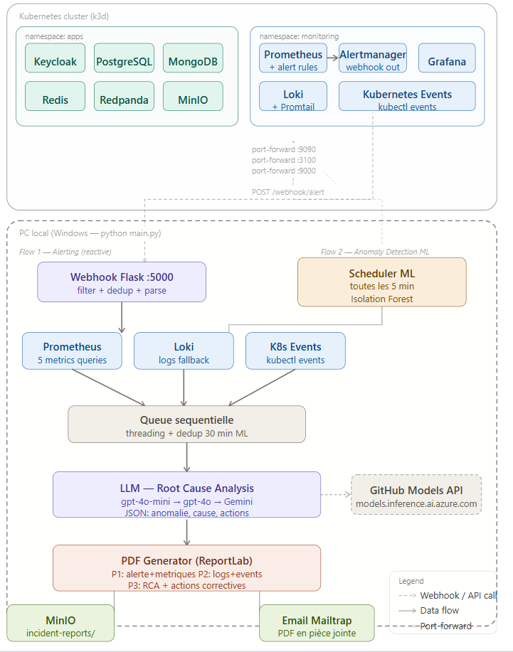

# 🤖 Agent IA — Monitoring Kubernetes avec RCA Automatisé

>  — Agent intelligent de monitoring --
> pour clusters Kubernetes avec détection d'anomalies ML et alertmanager 
> Root Cause Analysis automatisé via GPT-4.

---

## 📋 Description

Ce projet implémente un **agent IA de monitoring intelligent** pour
clusters Kubernetes capable de :

- 🔴 **Détecter les incidents** via Prometheus/Alertmanager
- 🧠 **Détecter les anomalies** proactivement via Isolation Forest (ML)
- 🤖 **Analyser les causes racines** (RCA) automatiquement via "gpt-4o-mini", "gpt-4o"  
- 📄 **Générer des rapports PDF** professionnels (3 pages)
- 📧 **Envoyer des notifications** email avec PDF en pièce jointe
- 🗂️ **Stocker les rapports** dans MinIO (S3 compatible)

## 🏗️ Architecture



## 📁 Structure du projet 

```

agent_IA/
├── main.py                    # Point d'entrée Flask + webhook
├── config.py                  # Configuration (credentials)
├── requirements.txt           # Dépendances Python
│
├── core/
│   ├── parser.py              # Parse alertes Alertmanager
│   ├── prometheus.py          # Collecte métriques Prometheus
│   ├── loki.py                # Collecte logs Loki
│   ├── gpt4.py                # "gpt-4o-mini", "gpt-4o" 
│   ├── queue_worker.py        # Pipeline de traitement
│   ├── kubernetes_events.py   # Events Kubernetes
│   └── anomaly/
│       ├── collector.py       # Collecte métriques ML
│       ├── detector.py        # Isolation Forest
│       └── scheduler.py       # Scheduler toutes les 5 min
│
├── reports/
│   ├── pdf_generator.py       # Génération PDF 3 pages
│   ├── minio_uploader.py      # Upload MinIO
│   └── email_sender.py        # Envoi email Mailtrap
│
├── utils/
│   └── extractors.py          # Utilitaires extraction
│
└── k8s/
├── alert-apps.yaml        # Règles alertes Prometheus
└── alertmanager.yaml      # Configuration Alertmanager

```

## 🚀 Installation
### Prérequis

- Python 3.10+
- kubectl configuré
- Cluster Kubernetes 
- déployés: Prometheus + Loki + MinIO + mongoDB + postgresql +redpanda + redis + keycloak   


### 1.  Environnement virtuel

python -m venv venv

### 2. Installer les dépendances

pip install -r requirements.txt

### 3.  Modifier avec vos credentials :

- le fichier `config.py` 
- modifier les nom de namespace des application selon votre kubernetes cluster 
- modifier les nom du pod ou service pour prometheuse et loki selon votre kubernetes cluster 

### 4. Appliquer les règles Kubernetes

- kubectl apply -f k8s/alert-apps.yaml
- kubectl apply -f k8s/alertmanager.yaml

### 5. Démarrer les port-forwards

promethuse 
loki 
MinIO (install via helm)


### 6. Lancer l'agent

python main.py

echo "# test" >> README.md